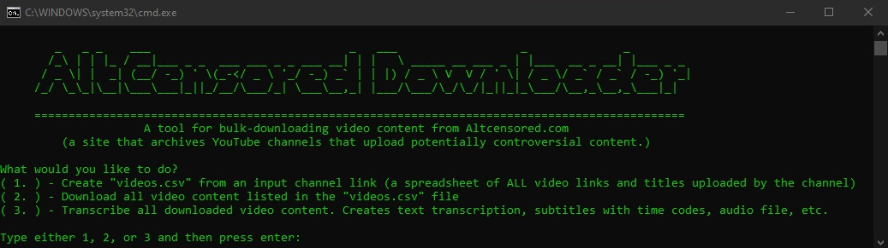

# Bulk_Downloader_For_AltCensored.com

    

A bulk-downloader for [AltCensored.com](https://altcensored.com/), a site that archives controversial YouTube channels that have a chance of being banned. 

When a creator is banned on YouTube, years of helpful content is removed, and AltCensored is a place where this content can be recovered.

(I do not endorese all the content on the site, but it can be a good source when looking for YouTube channels that have been banned.)

# How To Use

* Step 1. Make sure you have [Python 3.8](https://www.python.org/downloads/) or newer installed
* Step 2. Install [Google Chrome](https://www.google.com/chrome/) (make sure you have the latest version by visiting this link from the chrome browser: [Update Chrome](chrome://settings/help))
* Step 3. [Download the AltCensored Downloader files](https://github.com/lukeprofits/Bulk_Downloader_For_AltCensored.com/archive/refs/heads/main.zip) extract the files from the .zip you downloaded and put them in a folder
* Step 3. Run the program by double clicking `Windows_Launcher.bat` or from the commandline with `python AltcensoredDownloader.py`
* Step 4. Follow the prompts. You will need to paste the altcensored channel link to create a spreadsheet called "videos.csv", and then run the downloader after "videos.csv" has been created.
* Step 5. (COMING SOON!) transcribe all downloded videos and create subtitles using Whisper AI.

# Donate
I created this for free. If this helps you out, send me some Monero (XMR). 

XMR: `4At3X5rvVypTofgmueN9s9QtrzdRe5BueFrskAZi17BoYbhzysozzoMFB6zWnTKdGC6AxEAbEE5czFR3hbEEJbsm4hCeX2S`
